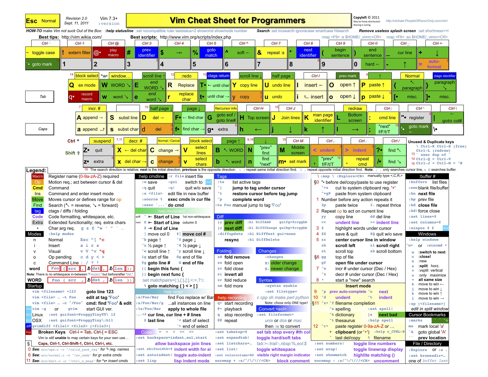

# vim_ide
本脚本是我使用的比较顺手的c/c++开发专用vim配置脚本，功能堪比简单的ide :)
- vim基本说明图：


## 安装
运行如下命令即可完成安装：
```
cd ~
git clone https://github.com/wuzangsama/vim_ide.git
cd vim_ide
sh install.sh
```

## 使用说明
### 一般使用
- vim的leader键映射成了`;`，可自行更改为其他顺手的键
- 配色方案为ron，可自行更改为其他主题，本人测试在xshell下此主题比较耐看
- airline在xshell下可能会有乱码，需要设置成特定字体，在windows下使用git clone https://github.com/powerline/fonts.git 命令下载后安装字体，然后在xshell下设置
- 映射`0`为定位到行头功能，比`^`键更加方便
- 映射`<leader>q`为关闭当前窗口功能
- 映射`<leader>w`为保存当前窗口功能
- 映射`<leader>WQ`为保存所有窗口内容并退出vim
- 映射`<leader>Q`为不做保存退出vim
- 映射`<C-w>` 或`TAB`为切换子窗口
- 映射`<C-k>`,`<C-j>`,`<C-h>`,`<C-l>`为切换上下左右窗口
- 使用`<C-Left>`和`<C-Right>`来切换已打开的buffer --old
### 编译调试
- 映射`<F7>`为编译c/c++文档
- 映射`<F5>`为调试c/c++ --old
### 替换
- 映射`<Leader>R`为替换非整词匹配，替换时不确认
- 映射`<Leader>rw`为替换整词匹配，替换时不确认
- 映射`<Leader>rc`为替换非整词匹配，替换时确认
- 映射`<Leader>rcw`,`<Leader>rwc`为替换整词匹配，替换时确认
### 插件快捷键
- 映射`<Leader>A`为切换h/cpp,h/c文件
- 使用`ma`/`mb`...等用来打标签，可实现同一文件的位置标记可视化，使用`` `a``/`` `b``可进行定位
```
  mx           Toggle mark 'x' and display it in the leftmost column
- 使用`gcc`来注释和反注释，使用`gcap`来注释整个段落
  dmx          Remove mark 'x' where x is a-zA-Z

  m,           Place the next available mark
  m.           If no mark on line, place the next available mark. Otherwise, remove (first) existing mark.
  m-           Delete all marks from the current line
  m<Space>     Delete all marks from the current buffer
  ]`           Jump to next mark
  [`           Jump to prev mark
  ]'           Jump to start of next line containing a mark
  ['           Jump to start of prev line containing a mark
  `]           Jump by alphabetical order to next mark
  `[           Jump by alphabetical order to prev mark
  ']           Jump by alphabetical order to start of next line having a mark
  '[           Jump by alphabetical order to start of prev line having a mark
  m/           Open location list and display marks from current buffer

  m[0-9]       Toggle the corresponding marker !@#$%^&*()
  m<S-[0-9]>   Remove all markers of the same type
  ]-           Jump to next line having a marker of the same type
  [-           Jump to prev line having a marker of the same type
  ]=           Jump to next line having a marker of any type
  [=           Jump to prev line having a marker of any type
  m?           Open location list and display markers from current buffer
  m<BS>        Remove all markers
```
- 使用`<F2>`可以在右边调出tag标签列表，方便查看函数列表等 --old
- 映射`gag`在工程文件夹下搜索选中的单词 --old
- 可视模式选中一部分单词，可以使用`<S-m>`来一次选中多个该单词，使用`<S-k>`跳过当前选中的单词
- 可以使用`<Leader>m`来高亮一个单词
- 可以按`F12`来切换鼠标作用在终端还是vim，切换到终端可以使用复制黏贴动作
- 因为跟YCM的按键冲突，改为使用`<Leader><tab>`键来做snip快捷输入
- 写完.h文件的申明后，在c文件或者cpp文件中使用`<Leader>PP`来生成函数定义
- 使用`<F3>`来调出文件浏览器
- 使用`+`来选中两个括号或大括号等成对符之间的内容，快速选中快速修改
- 使用`<Leader>ud`打开undo树，牛逼版u键 --old
- 使用`<C-P>`打开工程中搜索文件窗口，查找文件各种方便 --old
- 使用`<Leader>da`生成文档说明头，可以自行更改vimrc文件中的user来产生自己的头
- 将光标定位在函数定义或申明那一行，使用`<Leader>df`生成函数说明文档
- 补全时使用`tab`来选中想要的匹配项
- 除了使用默认的跳转命令，还可以使用`<Leader>j`来查找定义
- 使用`ga=`来对齐等号，使用`ga:`来对齐冒号，让代码更美观
- 使用`gcc`来注释和反注释，使用`gcap`来注释整个段落
- 使用`<Space>b`来打开buffer列表，使用`<Space>f`来搜索打开文件，使用`<Space>g`来搜索单词
- 使用`<Space>r`来打开最近打开文件，使用`<Space>o`来打开函数列表
- 使用`<Space>ci`来查找调用该函数的地方，使用`<Space>cf`来查找函数定义
- Surround插件说明
```
例子：
Old text                  Command     New text ~
 "Hello *world!"           ds"         Hello world!
 [123+4*56]/2              cs])        (123+456)/2
 "Look ma, I'm *HTML!"     cs"<q>      <q>Look ma, I'm HTML!</q>
 if *x>3 {                 ysW(        if ( x>3 ) {
 my $str = *whee!;         vlllls'     my $str = 'whee!';
 <div>Yo!*</div>           dst         Yo!
 <div>Yo!*</div>           cst<p>      <p>Yo!</p>

命令列表：
Normal mode
-----------
ds  - delete a surrounding
cs  - change a surrounding
ys  - add a surrounding
yS  - add a surrounding and place the surrounded text on a new line + indent it
yss - add a surrounding to the whole line
ySs - add a surrounding to the whole line, place it on a new line + indent it
ySS - same as ySs
Visual mode
-----------
s   - in visual mode, add a surrounding
S   - in visual mode, add a surrounding but place text on new line + indent it
Insert mode
-----------
<CTRL-s> - in insert mode, add a surrounding
<CTRL-s><CTRL-s> - in insert mode, add a new line + surrounding + indent
<CTRL-g>s - same as <CTRL-s>
<CTRL-g>S - same as <CTRL-s><CTRL-s>

其他常见用法
ci: 例如，ci(，或者ci)，将会修改()之间的文本；
di: 剪切配对符号之间文本；
yi: 复制；
ca: 同ci，但修改内容包括配对符号本身；
da: 同di，但剪切内容包括配对符号本身；
ya: 同yi，但复制内容包括配对符号本身。
PS. dib等同于di(。diB等同于di{。
```

## 小技巧
### 各种实用的snip快捷输入
- 输入once，按下`<Leader><tab>`可以生成头文件保护宏:)
### 其他待录入
